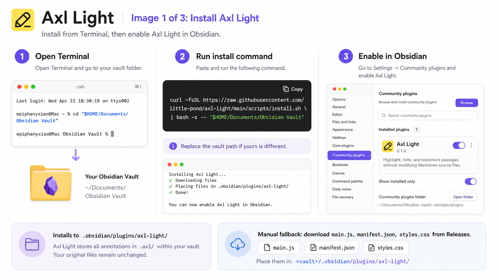

# Axl Light

Axl Light is a non-invasive Obsidian reading annotation plugin for Markdown and PDF files. It adds overlay highlights, sticky notes, search, jump, and Markdown export while keeping your original documents clean.

**This plugin never modifies your Markdown or PDF files.** Annotation data is stored separately in sidecar JSON files under `.obsidian-annotations/`.

This fork keeps text selection quiet by default. Select text and press `Alt+H` to open the six-color highlight palette only when you need it. The original automatic behavior remains available as a setting. It is based on the [upstream Axl Light project](https://github.com/little-pond/axl-light) and does not submit changes back to that repository.

## Features

- Overlay highlights for Markdown Live Preview, Source Mode, Reading View, and PDFs
- Mobile-friendly Reading View highlight recovery with delayed rendering and DOM observation
- On-demand floating toolbar with six colors, sticky note, copy, and annotation overview actions
- Right-side sticky note lane with Markdown-rendered notes
- Inline editing for sticky notes and sidebar notes
- Sidebar overview with search, color filtering, sorting, jump, delete, add-note, and export
- Sidecar JSON storage with fuzzy text-anchor relocation
- Windows-safe short sidecar filenames with legacy path migration

## Installation

### BRAT

Recommended for Windows users who do not want to touch the terminal.

1. Install the Obsidian BRAT plugin.
2. Run `BRAT: Add a beta plugin for testing`.
3. Paste this repository URL:

```text
https://github.com/ShengLi-Wang/axl-light-manual-palette
```

4. Enable `Axl Light` in `Settings -> Community plugins`.

### Quick Install

#### macOS / Linux

Run this in Terminal. Replace the path with your Obsidian vault path:

```bash
curl -fsSL https://raw.githubusercontent.com/ShengLi-Wang/axl-light-manual-palette/main/scripts/install.sh | bash -s -- "$HOME/Documents/Obsidian Vault"
```

Then restart Obsidian, open Settings → Community plugins, and enable Axl Light.



#### Windows

Run this in PowerShell. It will prompt for your Obsidian vault folder and uses your Documents folder as the default when it can:

```powershell
$script = Join-Path $env:TEMP "install-axl-light.ps1"
Invoke-WebRequest -UseBasicParsing -Uri "https://raw.githubusercontent.com/ShengLi-Wang/axl-light-manual-palette/main/scripts/install.ps1" -OutFile $script
powershell -NoProfile -ExecutionPolicy Bypass -File $script
```

To skip the prompt, pass the vault path:

```powershell
$script = Join-Path $env:TEMP "install-axl-light.ps1"
Invoke-WebRequest -UseBasicParsing -Uri "https://raw.githubusercontent.com/ShengLi-Wang/axl-light-manual-palette/main/scripts/install.ps1" -OutFile $script
powershell -NoProfile -ExecutionPolicy Bypass -File $script "C:\Users\your-name\Documents\Obsidian Vault"
```

If you downloaded this repository for development, you can also double-click `scripts\install.cmd`; it opens the same Windows installer prompt.

If PowerShell still blocks the script, use BRAT or the manual install below.

### Manual Install

1. Download these three files from the latest release:
   https://github.com/ShengLi-Wang/axl-light-manual-palette/releases/latest

   - `main.js`
   - `manifest.json`
   - `styles.css`

2. Move them to the plugin folder:

   macOS / Linux:

   ```text
   <your-vault>/.obsidian/plugins/axl-light/
   ```

   Windows:

   ```text
   C:\Users\your-name\Documents\Obsidian Vault\.obsidian\plugins\axl-light\
   ```

3. Restart Obsidian

4. Settings → Community plugins → Enable "Axl Light"

Do **not** download the source code ZIP from the green `Code` button. Obsidian needs the built release files.

## Usage

### Highlight Text

Select text in Markdown or PDF, then press `Alt+H`. Use the floating toolbar to choose a color, add a sticky note, copy the selection, or open the overview.

To restore the original selection-triggered behavior, enable `Show selection toolbar automatically` in the Axl Light settings.


### Edit Sticky Notes

Open the right-side sticky note lane or the annotation overview. Click the pencil button to edit a note inline. Press `Cmd/Ctrl + Enter` to save.


### Search, Jump, and Export

Use the annotation overview to search highlights and notes, jump back to the source position, delete annotations, add notes to existing highlights, or export everything into a new Markdown notes file.

## Commands

- `Show highlight palette for selection`: `Alt + H`
- `Highlight selected text`: `Cmd/Ctrl + Shift + H`
- `Add sticky note to selection`: `Cmd/Ctrl + Alt + M`
- `Toggle sticky note lane`: `Cmd/Ctrl + Shift + N`
- `Open annotation overview`

## Data Storage

Axl Light stores annotations in your vault:

```text
.obsidian-annotations/
  index.json
  axl--notes__reading__book.md--7b85f6b1c02a41f7.json
  axl--papers__example.pdf--5af1299d722f61e0.json
```

The sidecar files contain anchors, selected text, colors, sticky note content, optional titles, timestamps, and PDF page rectangles.
The filenames are intentionally short and Windows-safe; the original vault path lives inside the JSON and `index.json`. Older long sidecar filenames are migrated automatically when Axl Light reads them.

Your original `.md` and `.pdf` files remain unchanged. If you disable or remove the plugin, your documents stay clean.

## Known Limitations

- Reading View highlights are matched against rendered DOM text, so unusual themes or plugins that heavily rewrite rendered HTML may affect placement.
- PDF support depends on Obsidian's built-in PDF viewer DOM structure.
- PDF text selection and rectangle anchors may need relocation improvements for rotated pages or unusual PDF layouts.
- Very large annotation sets currently render directly in the sidebar; virtual scrolling is planned.

## Development

```bash
npm install
npm run dev
```

For production builds:

```bash
npm run build
```

Copy `main.js`, `manifest.json`, and `styles.css` into:

```text
<your-vault>/.obsidian/plugins/axl-light/
```

## License

MIT. See [LICENSE](LICENSE).
